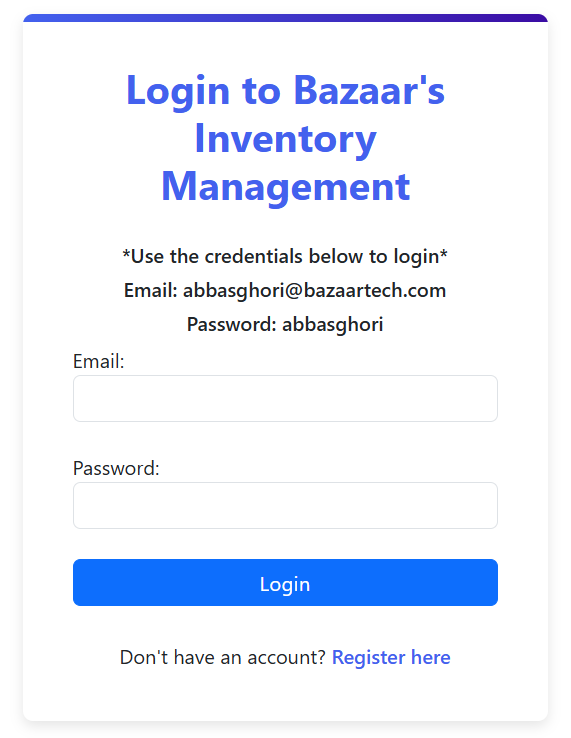
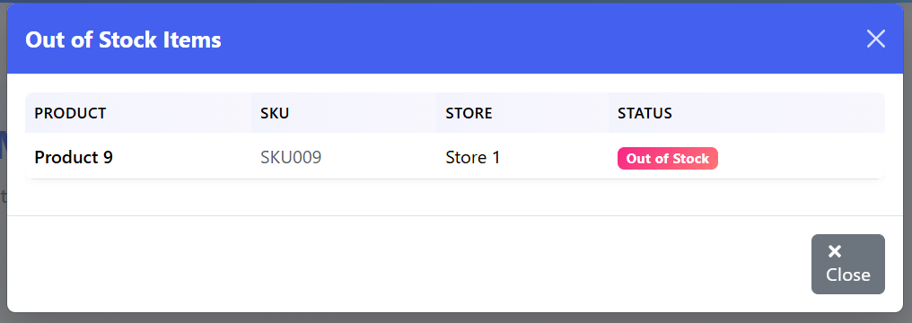

# Bazaar Inventory Tracking System

## Project Overview

The Bazaar Inventory Tracking System is a scalable inventory management solution designed for retail businesses, with a focus on kiryana stores. It has evolved from tracking inventory for a single store to supporting thousands of stores with a distributed architecture. The system enables real-time tracking of stock levels, manages product movement, and provides comprehensive audit logging for all inventory operations.


*Main dashboard interface showing the inventory overview and key metrics*

## Evolution Stages

### Stage 1: Single Store Inventory Tracking
- Basic inventory tracking for a single kiryana store
- Simple data model for products, stock movements, and quantities
- Local storage using flat files or SQLite
- Command-line interface for basic operations

### Stage 2: Multi-Store Platform (500+ Stores)
- REST API endpoints for core inventory actions
- Centralized product catalog with store-specific stock
- Filter and reporting capabilities by store, date range
- Basic authentication and request throttling
- PostgreSQL for reliable data storage

### Stage 3: Enterprise-Scale Solution (1000+ Stores)
- Horizontally scalable architecture
- Asynchronous processing with Celery/Redis
- Read/write separation with caching strategies
- Comprehensive API rate limiting
- Complete audit logging system
- High-performance, concurrent operations

## Tech Stack

### Backend
- **Framework**: Django 5.1 with Django REST Framework
- **Database**: PostgreSQL for reliable data storage
- **Authentication**: Token-based authentication using DRF's TokenAuthentication
- **Async Processing**: Celery with Redis as message broker for handling stock movements
- **Caching**: Redis for improved performance on frequently accessed data

### Frontend
- **Framework**: Next.js 14 with TypeScript for type safety
- **State Management**: React hooks for component state
- **UI Components**: Custom components with Bootstrap base styling
- **API Integration**: Axios for REST API communication
- **Routing**: Next.js App Router for client-side navigation
- **Styling**: CSS modules with responsive design principles

## Design Decisions & Trade-offs

### Data Modeling
- **Normalized Database Schema**: Optimized for data integrity and reducing redundancy
- **Indexed Foreign Keys**: Improves query performance for common operations
- **JSON Fields for Audit Details**: Provides flexibility for storing varying audit metadata

### API Design
- **RESTful Architecture**: Standard HTTP methods for CRUD operations
- **ViewSets**: DRF ViewSets for consistent API interfaces
- **Filtering & Pagination**: Query parameter-based filtering with pagination for large datasets
- **Token Authentication**: Balance of security and simplicity for API access

### Scalability Strategies
- **Horizontal Scaling**: Application layer can scale across multiple nodes
- **Asynchronous Processing**: Stock movements handled in background tasks
- **Caching**: Frequently accessed data stored in Redis
- **Database Indexing**: Strategic indexes on commonly queried fields
- **Read/Write Separation**: Heavy read operations optimized separately from writes

### Performance Considerations
- **Bulk Operations**: Batch processing for high-volume transactions
- **Query Optimization**: Efficient queries using select_related and prefetch_related
- **Connection Pooling**: Database connection reuse for improved performance
- **Rate Limiting**: Prevents API abuse and ensures fair resource allocation

## Core Features

### Inventory Management
- **Stock Tracking**: Real-time monitoring of inventory levels across all stores
- **Stock Movements**: Support for stock-in, sales, and manual removals
- **Advanced Filtering**: Filter stock by store, status, date range, supplier, and more
- **Alerts**: Low stock and out-of-stock notifications


*Stock management interface for creating and managing inventory movements*


*Stock view table showing current inventory levels across stores*

### Multi-Store Support
- **Centralized Catalog**: Single product catalog across all stores
- **Store-Specific Inventory**: Track individual stock levels for each store
- **Location Management**: Organize stores by location for easier management

### User System
- **Role-Based Access**: Different permission levels (admin, manager, staff)
- **Secure Authentication**: Token-based authentication with secure password handling
- **Activity Tracking**: Comprehensive user action logging



*Login interface for user authentication*


*User registration interface with role selection*

### Audit and Logging
- **Comprehensive Audit Trail**: Every inventory change is tracked with user attribution
- **Filtering Capabilities**: Filter logs by action type, date range, user, and more
- **Data Integrity**: Historical record for compliance and accountability


*Activity logs interface with comprehensive filtering options*

### Dashboard & Analytics
- **Visual Overview**: Summary cards showing key metrics
- **Interactive Interface**: Tabbed interface for different aspects of inventory management
- **Real-time Data**: Up-to-date stock levels and movement information
- **Integrated Views**: All functionality accessible through dashboard tabs (stock overview, inventory management, activity logs)


*Advanced filtering options for inventory data*


*Alert modal displaying items with low stock levels*


*Alert modal displaying items that are out of stock*

## System Architecture

The system follows a modern client-server architecture with clear separation of concerns:

### Backend API Layer
- **RESTful API**: Standard HTTP methods for CRUD operations
- **ViewSets**: Django REST Framework ViewSets for model operations
- **Serializers**: Transform model data to/from JSON
- **Permissions**: Role-based access control for API endpoints

### Data Processing Layer
- **Celery Tasks**: Asynchronous processing of stock movements
- **Fallback Processing**: Direct processing when Celery is unavailable
- **Transaction Management**: Atomic operations to ensure data consistency

### Data Storage Layer
- **PostgreSQL**: Relational database for structured data
- **Database Indexing**: Optimized for high-volume queries
- **Data Models**: Normalized schema with appropriate relationships

### Frontend Layer
- **Component Architecture**: Reusable UI components
- **Dashboard Design**: Consolidated interface with tabs for all functionality
- **Authentication Flow**: Protected routes with token validation
- **Responsive Design**: Mobile-friendly interface

## Frontend Structure

### Layout and Navigation
- `DashboardLayout`: Common layout wrapper for authenticated pages
- `Navbar`: Primary navigation with links to main sections
- `Footer`: Consistent footer across all pages

### Key Components
- `ViewStocks`: Dashboard component for stock overview
- `ProductsView`: Product management interface
- `LogsView`: Activity log display with filtering
- `ManageStocks`: Interface for creating stock movements
- `LowStockModal` & `OutOfStockModal`: Alert displays for inventory issues

### Pages
- `/dashboard`: Unified dashboard with tabbed interface for all functionality
  - Stock Overview tab
  - Products tab
  - Manage Inventory tab
  - Activity Logs tab
  - Settings tab (admin users only)
- `/login` & `/register`: Authentication pages

## Backend Structure

## Data Models

### Core Entities
- **User**: Authentication and role information
- **Store**: Physical locations
- **Supplier**: Product suppliers
- **Product**: Items for sale with SKU
- **Stock**: Inventory levels per product per store
- **StockMovement**: Records of inventory changes
- **AuditLog**: System-wide activity logging

### Entity Relationship Diagram

*Database schema showing relationships between core entities*

## API Endpoints

### Authentication
- `POST /login/` - User login and token generation
- `POST /register/` - New user registration
- `POST /api/logout/` - User logout and token invalidation

### Products
- `GET /products/` - List all products
- `POST /products/` - Create a product
- `GET /products/{id}/` - Retrieve product details
- `PUT /products/{id}/` - Update product
- `DELETE /products/{id}/` - Delete product

### Stock Management
- `GET /stocks/` - List all stock records with filtering
- `GET /api/stock/` - Advanced stock filtering API
- `GET /stock-movements/` - List stock movements
- `POST /stock-movements/` - Create stock movement (stock in/out)
- `GET /stock-movements/{id}/` - Retrieve movement details

### Store Management
- `GET /stores/` - List all stores
- `POST /stores/` - Create a store
- `GET /stores/{id}/` - Retrieve store details
- `PUT /stores/{id}/` - Update store
- `DELETE /stores/{id}/` - Delete store

### Suppliers
- `GET /suppliers/` - List all suppliers
- `POST /suppliers/` - Create a supplier
- `GET /suppliers/{id}/` - Retrieve supplier details
- `PUT /suppliers/{id}/` - Update supplier
- `DELETE /suppliers/{id}/` - Delete supplier

### System
- `GET /api/logs/` - Retrieve filtered audit logs
- `GET /api/generate-dummy-data/` - Generate sample data (dev/testing)
- `GET /api/test-celery/` - Test Celery/Redis connection

## Key Implementation Details

### Stock Movement Processing
The system handles stock movements with a robust process:

1. When a stock movement is created via `POST /stock-movements/`:
   - The request is validated by `StockMovementSerializer`
   - `StockMovementViewSet.perform_create()` is called
   - The system attempts to process the movement asynchronously with Celery
   - If Celery fails, it falls back to direct processing

2. During processing:
   - The system retrieves or creates the corresponding Stock record
   - Updates quantity based on movement type (IN/OUT/REM)
   - Marks the movement as processed to prevent duplicate processing
   - Creates an audit log entry with details of the change
   - Invalidates any related cache entries

### Authentication Flow
The authentication system implements a secure token-based approach:

1. User login:
   - Credentials validated against database
   - Authentication token generated and returned
   - Frontend stores token in localStorage
   - Token attached to subsequent API requests

2. Request authentication:
   - Axios interceptor adds token to request headers
   - Backend validates token for protected endpoints
   - Invalid tokens result in 401 responses

### Real-time Inventory Updates
The stock tracking system ensures real-time accuracy:

1. Stock levels are updated immediately after movement processing
2. Dashboard displays current inventory status with color-coded alerts
3. Low stock and out-of-stock items are visually highlighted

## Deployment Instructions

### Prerequisites
- Node.js 18+
- Python 3.10+
- PostgreSQL 13+
- Redis 5+

### Backend Setup
```bash
# Clone repository and navigate to project directory
cd inventoryProject

# Create and activate virtual environment
python -m venv venv
.\venv\Scripts\Activate.ps1  # for windows

# Install dependencies
pip install -r requirements.txt

# Configure database in settings.py

# Run migrations
python manage.py migrate

# Start server
python manage.py runserver
```

### Celery Worker Setup
```bash
# In a separate terminal
cd inventoryProject
.\venv\Scripts\Activate.ps1  # for windows

# Start Celery worker
celery -A inventoryProject worker --loglevel=info
```

### Frontend Setup
```bash
# In a separate terminal
cd frontend

# Install dependencies
npm install

# Start development server
npm start
```

## Security Features

- **Token-based Authentication**: Secure token generation and validation
- **Password Hashing**: Passwords stored using Django's secure hashing
- **CORS Protection**: Configured CORS policy in Django settings
- **Authorization Controls**: Role-based access to endpoints
- **Input Validation**: Request validation through serializers
- **Audit Logging**: Security events logged for accountability

## Scalability Considerations

- **Database Indexing**: Key fields indexed for performance
- **Asynchronous Processing**: Stock movements handled by Celery
- **Caching Strategy**: Frequently accessed data cached in Redis
- **Query Optimization**: Efficient database queries with select_related
- **Pagination**: API endpoints paginated for large datasets

## Assumptions

1. Internet connectivity is required for real-time inventory updates
2. Each store has at least one staff member with system access
3. Products have unique SKUs across all stores
4. The system will primarily be accessed via web browsers
5. PostgreSQL will be available in production environments
6. Redis is available for caching and message brokering

## License

© Bazaar Technologies. All rights reserved.

This project is proprietary software for Bazaar Technologies. 